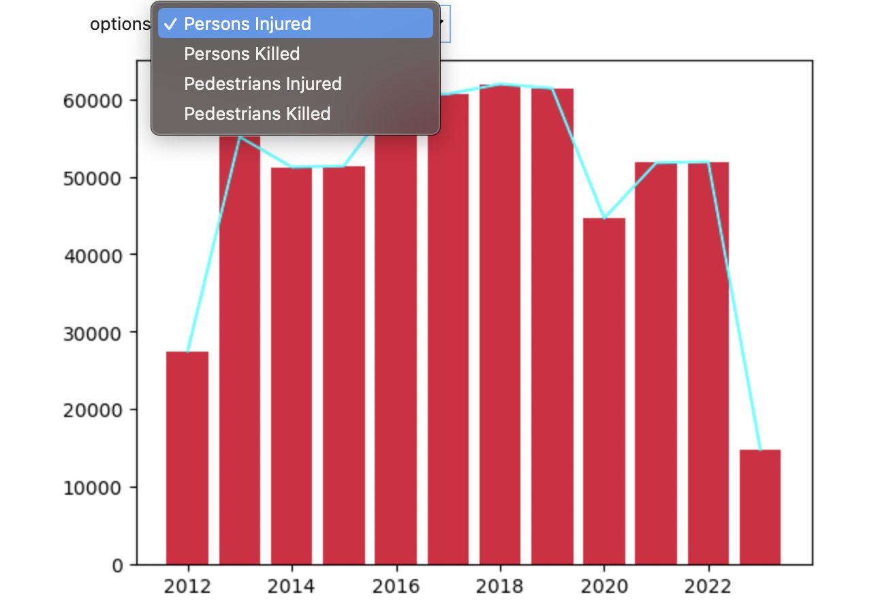
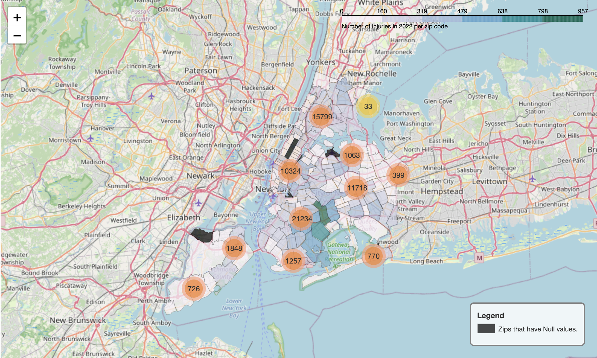
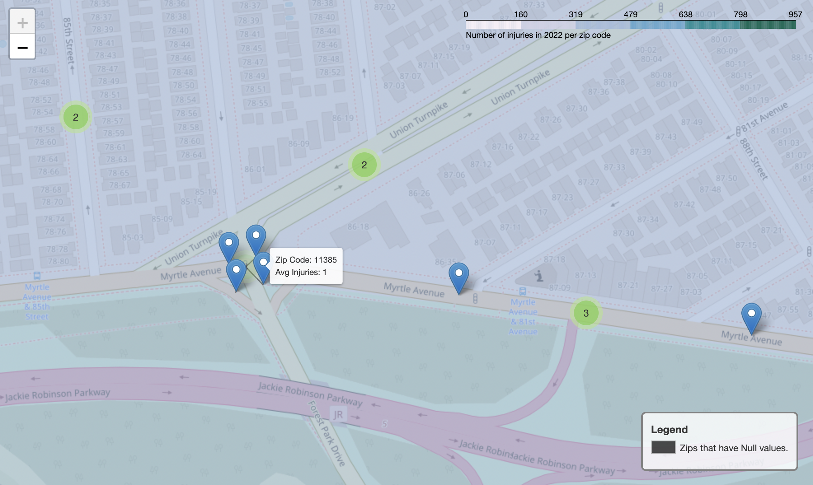
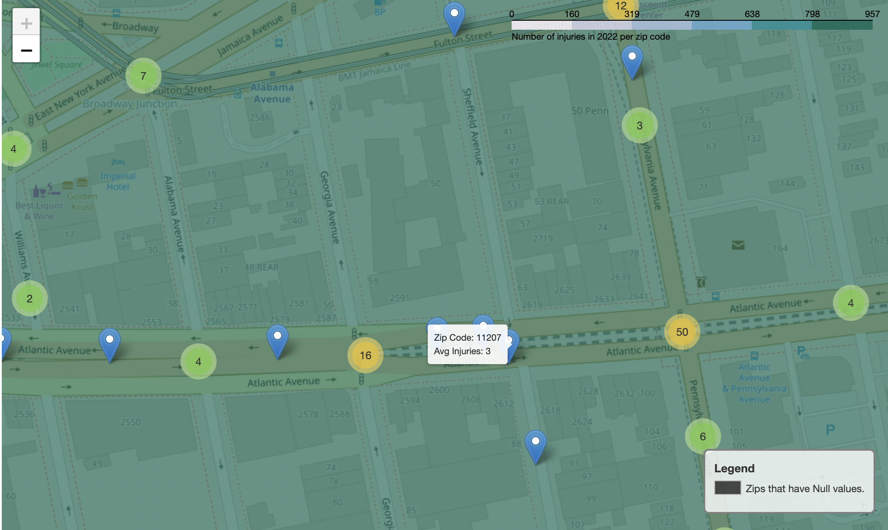

Hello! Let me tell you a little more about this project! I aimed to practice the skills learned from my data mine classes, and I wanted to expand upon these skills as well. I created a couple of visualizations using JupyterLab, pandas, matplotlib, and folium. I would love to have a live web page up and running on Git Hub, but since this file exceeds 25MB, I have included screenshots of the visualizations instead. 

First, I have 4 screenshots showing a bar plot about the number of injuries and deaths within the pedestrian and total person category. You can view what you are looking for through the dropdown shown.  

