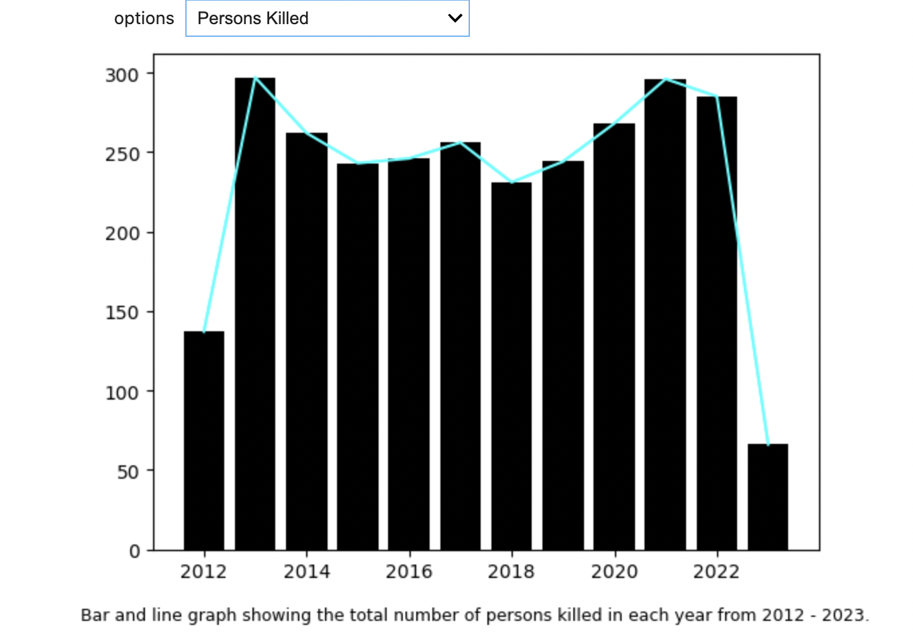

Hello! Please visit https://sindhu-manickam.github.io/NYC-Motor-Vehicle-Accidents/ to see the full site. You can view the code [here](https://github.com/sindhu-manickam/NYC-Motor-Vehicle-Accidents).

Now, let me tell you a little more about this project! I aimed to practice the skills learned from my data mine classes, and I wanted to expand upon these skills as well. I created a couple of visualizations using JupyterLab, pandas, matplotlib, ipywidgets, and folium. I used a dataset from Kaggle to create these visualizations. I would love to have a live web page up and running on Git Hub, but since this file exceeds 25MB, I have included screenshots of the visualizations instead. I am currently working on getting a live page up.

First, I have 4 screenshots showing a bar plot about the number of injuries and deaths within the pedestrian and total person category. You can view what you are looking for through the dropdown shown.  

This dropdown menu was created by first adding a new column into the data frame to include both date and time. Using this, I was able to just extract information about what year each crash occurred and grouped these together. Next, I made a dropdown menu for each category ('NUMBER OF PERSONS INJURED', 'NUMBER OF PERSONS KILLED', 'NUMBER OF PEDESTRIANS INJURED', 'NUMBER OF PEDESTRIANS KILLED') using ipywidgets. I went ahead and made a list of all the unique years in the data frame, and summed up the number of persons injured, persons killed, pedestrians injured, and pedestrians killed respectively. These lists were then implemented into a function in which I displayed bar charts and line charts using Matplotlib. You can view the [full code](https://github.com/sindhu-manickam/NYC-Motor-Vehicle-Accidents) inside the zip folder I have attached in my GitHub repo!

Some information about this map: 
The key shown in the top right corner shows the total number of injuries that occcured in each zip code in 2022. Zoom into the area of your choice and hover over a pinpoint to get information about which zip code it is. It is important to note that the marker cluster includes every location point from the dataframe in the year 2022. Some of these data points do not have any injuries. That is why there are more markers on the map than injuries. 

This map was made using Folium and a GeoJson file of NYC, and I added in the legend using some javascript. I created a new data frame that contained the number of persons injured, zip code, latitude, and longitude (all from the year 2022). I made a function using MarkerCluster to display a marker where an accident was reported. Next, I added a hover feature so that the user can see which zip code the accident occurred in, and how many people were injured at the location. Additionally, I added choropleth features to display where the most injuries occurred in the year 2022. Darker zip codes indicate more injuries. Feel free to look at the [code attached in my github repo](https://github.com/sindhu-manickam/NYC-Motor-Vehicle-Accidents)! 

